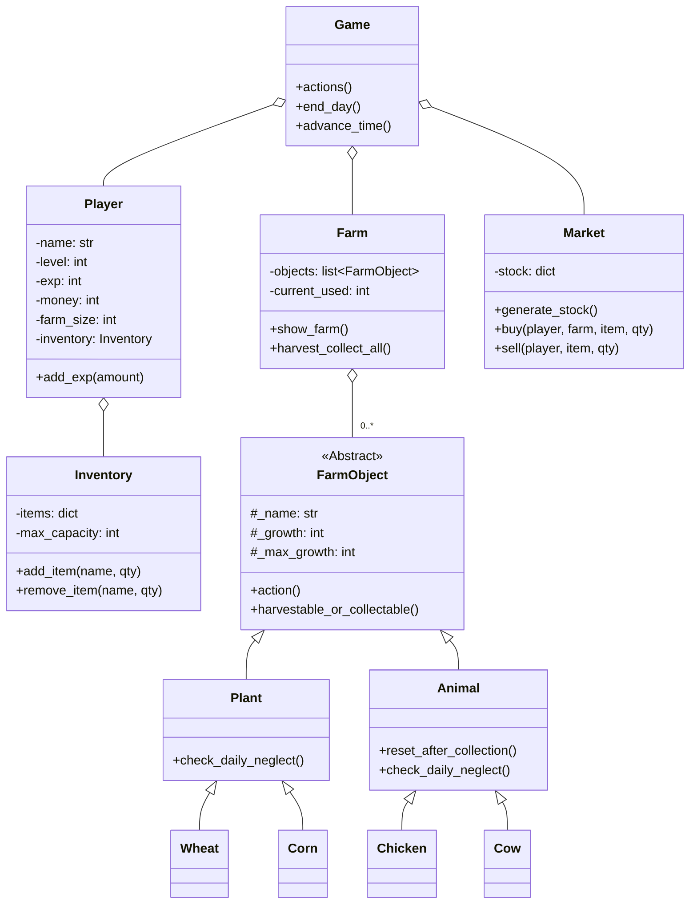

EN | [ID](docs/README_ID.md) | [CN](docs/README_CN.md)

# 🌾 Farming Game

**Farming Game** is a terminal-based farming simulation built in Python. Grow crops, raise animals, juggle resources, and outlast the rising daily tax. Can you survive and thrive as a farmer?

---

## Table of Contents

- [Features](#features)
- [Gameplay Preview](#gameplay-preview)
- [Game Overview](#game-overview)
- [Installation](#installation)
- [Getting Started](#getting-started)
- [Code Structure](#code-structure)
- [Architecture & Class Diagram](#architecture--class-diagram)
- [Localization](#localization)
- [Contributing](#contributing)
- [Authors](#authors)
- [Contact & Feedback](#contact--feedback)

---

## Features

- **Text-Based Interface:** Play interactively in your terminal.
- **Farm Management:** Plant and harvest crops, feed and raise animals.
- **Dynamic Market:** Buy seeds and animals, sell your products; market stock resets daily.
- **Progression System:** Level up to expand your farm and inventory capacities.
- **Day/Night Cycle:** Actions consume time; day ends at 22:00.
- **Neglect System:** Crops/animals lose growth or die if neglected.
- **Economic Survival:** Pay daily taxes that increase as days progress; bankruptcy ends the game.
- **Multi-language Documentation:** English, Indonesian, and Chinese versions available.

---

## 🎮 Gameplay Preview

When you launch Farming Game, you'll be greeted by a clear, interactive status screen:

```
================================================================================
🧑‍🌾 FARMER: ALEX  |  ⭐ LV: 3  |  💰 MONEY: $125  |  🗓️ DAY: 5  |  ⏰ TIME: 12:00  |  📈 EXP: 34/50
================================================================================

==================================================
🚜 FARM STATUS
--------------------------------------------------
[1 ] 🌱 Wheat       (1 slot) [3/3 ] -> READY! (Action: ✅)
[2 ] 🌱 Corn        (1 slot) [1/3 ] -> LOW GROWTH! (Action: ❌)
[3 ] 🐄 Cow         (3 slot) [5/5 ] -> READY! (Action: ✅)
[4 ] 🐔 Chicken     (1 slot) [2/2 ] -> READY! (Action: ✅)
--------------------------------------------------
SLOTS USED: 6/18 | REMAINING SLOTS: 12

==================================================
🎒 INVENTORY
--------------------------------------------------
  Wheat          : 2 QTY
  Milk           : 1 QTY
  Egg            : 3 QTY
--------------------------------------------------
SLOTS USED: 3/20

==================================================
📜 MAIN MENU:
==================================================
  1    Water plants (💧 +1 hour per plant)
  2    Feed animals (🥕 +1 hour per animal)
  3    Harvest & Collect (🌾🥚 END DAY/Collect All)
  4    Market Menu (🛒 Buy/Sell)
  5    View Game Rules (📚)
  6    Quit game (🚪)
==================================================
Choose action (1-6):
```

**Your actions:**
- See the growth status of your crops and animals, including which are ready to harvest or need attention.
- Water plants, feed animals, harvest crops, collect animal products, and manage your inventory.
- Visit the market to buy seeds/animals or sell your produce.
- Survive each day as taxes increase, striving to expand your farm and reach new levels.
- If you neglect crops or animals, they lose growth and may die. Run out of money, and it's game over!

---

## Game Overview

Farming Game is a resource management simulation. Each turn represents a day on your farm. Balance time, money, and space to optimize your farm’s output and survive as many days as possible.

**Core Gameplay Elements:**
- Plant and water crops
- Feed and collect from animals
- Sell products at a market with variable stock
- Pay daily taxes
- Avoid bankruptcy and keep your farm thriving
- Level up to unlock more farm slots and inventory space

---

## Installation

### Prerequisites

- Python 3.x (No external dependencies required)

### Setup

1. Clone the repository:
   ```sh
   git clone https://github.com/Rolexx17/Farming-Game.git
   cd Farming-Game
   ```

2. (Optional) Create a virtual environment:
   ```sh
   python -m venv venv
   source venv/bin/activate  # On Windows: venv\Scripts\activate
   ```

---

## Getting Started

1. Ensure all files are in the correct directory structure.
2. Run the main game file:
   ```sh
   python Game.py
   ```
3. Enter your name when prompted.
4. Follow the menu instructions to play.

---

## Code Structure

```
Farming-Game/
├── Game.py                # Main game loop and menu
├── Entities/              # Core modules for game logic
│   ├── Farm.py            # Farm management and crop/animal slots
│   ├── Farm_Object.py     # Abstract base and main classes for farm entities
│   ├── Inventory.py       # Inventory logic for products and capacity
│   ├── Market.py          # Market logic for buying/selling
│   ├── Player.py          # Player stats, level, and progression
│   └── Utils.py           # Utility functions and constants
├── README.md
├── .gitignore
└── docs/
    ├── README_ID.md       # Indonesian translation
    └── README_CN.md       # Chinese translation
```

See the [Entities](Entities/) directory for modular logic and class definitions.

---

## Architecture & Class Diagram

The code uses object-oriented principles for maintainability and scalability.



---

## Localization

- [English](README.md)
- [Indonesian](docs/README_ID.md)
- [Chinese](docs/README_CN.md)

---

## Contributing

Pull requests, suggestions, and feature additions are welcome!

- Fork the repository
- Create a branch (`git checkout -b feature-name`)
- Commit your changes
- Open a pull request

---

## Authors

<table border="0" cellspacing="10" cellpadding="5">
  <tr>
    <td align="center" style="border: 1px solid #555; padding: 10px;">
      <a href="https://github.com/Rolexx17">
        
      </a>
      <br/>
      <a href="https://github.com/Rolexx17">Rolexx17</a>
    </td>
    <td align="center" style="border: 1px solid #555; padding: 10px;">
      <a href="https://github.com/cherriebuns">
        
      </a>
      <br/>
      <a href="https://github.com/cherriebuns">cherriebuns</a>
    </td>
    <td align="center" style="border: 1px solid #555; padding: 10px;">
      <a href="https://github.com/Rolexx17">
        
      </a>
      <br/>
      <a href="https://github.com/Rolexx17">Rolexx17</a>
    </td>
    
  </tr>
</table>

---

## Contact & Feedback

Open issues or PRs for bugs, feature requests, or feedback.  
For direct contact, reach out via GitHub profiles above.
