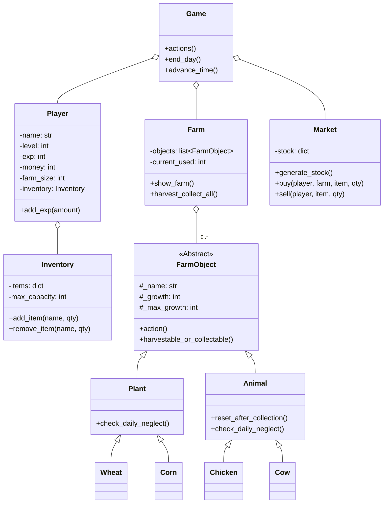

EN | [ID](README_ID.md) | [CN](README_CN.md)
# 🌾 Hay Day Lite: A Python Farming Sim


Welcome to **Hay Day Lite**, a command-line farming simulation game built with Python. Manage your farm, plant crops, raise animals, and sell your products at the market. Your goal is to survive as long as possible by managing your money and paying an ever-increasing daily tax. This project is a comprehensive demonstration of Object-Oriented Programming, featuring inheritance, abstract classes, and a modular design.

---

## 🎮 Gameplay Demo

The entire game runs in your terminal, providing a clear and interactive farming experience.

**Manage your farm, inventory, and check the time all in one screen:**
```
================================================================================
🧑‍🌾 FARMER: HANS | ⭐ LV: 1 | 💰 MONEY: $75 | 🗓️ DAY: 1 | ⏰ TIME: 08:00 | 📈 EXP: 0/20
================================================================================

==================================================
🚜 FARM STATUS
--------------------------------------------------
[1 ] 🌱 Wheat       (1 slot) [3/3 ] -> READY! (Action: ✅)
[2 ] 🌱 Wheat       (1 slot) [2/3 ] -> Growing... (Action: ✅)
[3 ] 🌱 Wheat       (1 slot) [1/3 ] -> LOW GROWTH! (Action: ❌)
[4 ] 🐄 Cow         (3 slot) [5/5 ] -> READY! (Action: ✅)
--------------------------------------------------
SLOTS USED: 6/15 | REMAINING SLOTS: 9

==================================================
🎒 INVENTORY
--------------------------------------------------
  Milk           : 2 QTY
--------------------------------------------------
SLOTS USED: 2/15

==================================================
📜 MAIN MENU:
==================================================
 1    Water plants (💧 +1 hour per plant)
 2    Feed animals (🥕 +1 hour per animal)
 3    Harvest & Collect (🌾🥚 END DAY/Collect All)
 4    Market Menu (🛒 Buy/Sell)
 5    View Game Rules (📚)
 6    Quit game (🚪)
==================================================
Choose action (1-6):
```

---

## ✨ Core Features

-   **Farming Simulation**: Plant crops, raise animals, and manage your farm's limited space.
-   **Dynamic Day Cycle**: Time advances as you perform actions. The day ends at 22:00, automatically triggering daily taxes, market restocks, and neglect checks.
-   **Economic Challenge**: Start with limited funds, buy seeds and animals from a dynamic market, sell your products, and pay a daily tax that increases over time. Go bankrupt, and it's game over!
-   **Leveling & Progression**: Gain EXP from harvesting and collecting to level up. Each level increases your farm size and inventory capacity.
-   **Dynamic Market**: The market's stock of seeds and animals changes randomly every day, requiring you to adapt your strategy.
-   **Neglect System**: Plants and animals must be cared for daily. If neglected, their growth will decrease, and they can eventually die and disappear from your farm.
-   **Resource Management**: Carefully balance your time, money, farm space, and inventory capacity to survive for as many days as possible.

---

## 🛠️ Technical Showcase

This project is a practical demonstration of key programming principles:

-   **Object-Oriented Programming (OOP)**: The entire project is built around a clear hierarchy of classes, including `Game`, `Player`, `Farm`, `Market`, and `FarmObject`.
-   **Abstract Base Classes (ABCs)**: The `FarmObject` class is an abstract class that defines a common interface for all farm entities, ensuring that both `Plant` and `Animal` have consistent methods.
-   **Inheritance**: `Plant` and `Animal` inherit from `FarmObject`. Specific types like `Wheat`, `Corn`, `Chicken`, and `Cow` then inherit from `Plant` or `Animal`, demonstrating a multi-level inheritance structure.
-   **Modular Design**: The code is separated into logical modules (`Entities`, `Game.py`, etc.), making the project organized and easy to maintain.

---

## 🏛️ Architecture & Class Diagram

The game's architecture is managed by the `Game` class, which holds instances of `Player`, `Farm`, and `Market`. The `Farm` contains a list of `FarmObject`s, which are concrete instances of `Plant` and `Animal` subclasses.



---

## 🚀 Getting Started

No external libraries are needed to run this game.

### Prerequisites
- Python 3.x

### Running the Game
1.  Ensure all project files are in the same directory structure.
2.  Open a terminal or command prompt.
3.  Navigate to the project's root directory.
4.  Run the main game file:
    ```sh
    python Game.py
    ```
5.  Enter your name and follow the on-screen menus to play!
