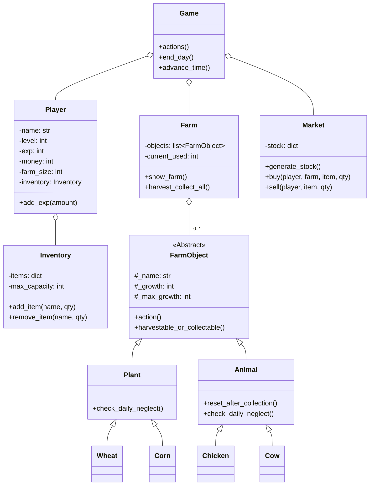

[EN](../README.md) | [ID](README_ID.md) | CN

# 🌾 Farming Game

**Farming Game** 是一个用 Python 构建的终端农场模拟游戏。种植作物，饲养动物，管理资源，并在不断上涨的每日税收中生存下来。你能成为最成功的农场主吗？

---

## 目录

- [功能](#功能)
- [游戏预览](#游戏预览)
- [游戏概述](#游戏概述)
- [安装](#安装)
- [开始游戏](#开始游戏)
- [代码结构](#代码结构)
- [架构与类图](#架构与类图)
- [本地化](#本地化)
- [贡献](#贡献)
- [作者](#作者)
- [联系与反馈](#联系与反馈)

---

## 🌟 功能

- **文本界面：** 在你的终端交互式游玩。
- **农场管理：** 种植和收获作物，喂养和养殖动物。
- **动态市场：** 购买种子和动物，出售你的产品；市场库存每天重置。
- **进阶系统：** 升级以扩大农场和物品栏容量。
- **昼夜循环：** 每个动作消耗时间；22:00结束一天。
- **忽视系统：** 未照料的作物/动物会失去成长甚至死亡。
- **经济生存：** 每天缴纳不断上涨的税费；破产即游戏结束。
- **多语言文档：** 支持英文、印尼语和中文。

---

## 🎮 游戏预览

启动 Farming Game 后，你会看到如下清晰、交互式的状态界面：

```
================================================================================
🧑‍🌾 农场主：ALEX  |  ⭐ 等级: 3  |  💰 金钱: $125  |  🗓️ 第5天  |  ⏰ 时间: 12:00  |  📈 经验值: 34/50
================================================================================

==================================================
🚜 农场状态
--------------------------------------------------
[1 ] 🌱 小麦       (1格) [3/3 ] -> 可收获！(操作: ✅)
[2 ] 🌱 玉米       (1格) [1/3 ] -> 生长缓慢！(操作: ❌)
[3 ] 🐄 奶牛       (3格) [5/5 ] -> 可收获！(操作: ✅)
[4 ] 🐔 鸡         (1格) [2/2 ] -> 可收获！(操作: ✅)
--------------------------------------------------
已用格数: 6/18 | 剩余格数: 12

==================================================
🎒 物品栏
--------------------------------------------------
  小麦          : 2 个
  牛奶          : 1 个
  鸡蛋          : 3 个
--------------------------------------------------
已用格数: 3/20

==================================================
📜 主菜单：
==================================================
  1    浇灌作物 (💧 每株+1小时)
  2    喂养动物 (🥕 每只+1小时)
  3    收获与收集 (🌾🥚 结束一天/收获全部)
  4    市场菜单 (🛒 购买/出售)
  5    查看游戏规则 (📚)
  6    退出游戏 (🚪)
==================================================
请选择操作 (1-6):
```

**你的操作：**
- 查看作物和动物的成长状态，包括哪些可收获或需照料。
- 浇灌作物、喂养动物、收获作物、收集动物产品并管理物品栏。
- 前往市场购买种子/动物或出售农产品。
- 每天税费提高，努力扩展农场和提升等级。
- 忽略作物或动物会使其失去成长甚至死亡。金钱归零则游戏结束！

---

## 📝 游戏概述

Farming Game 是一个资源管理模拟游戏。每回合代表农场的一天。你需平衡时间、金钱和空间，优化农场收益，尽可能多地生存下去。

**核心玩法元素：**
- 种植和浇灌作物
- 喂养和收集动物产品
- 在市场出售产品，库存每日变化
- 缴纳每日税费
- 避免破产，保持农场繁荣
- 升级解锁更多农场格与物品栏容量

---

## 💻 安装

### 先决条件

- Python 3.x（无需额外依赖）

### 安装步骤

1. 克隆仓库：
   ```sh
   git clone https://github.com/Rolexx17/Farming-Game.git
   cd Farming-Game
   ```

2. （可选）创建虚拟环境：
   ```sh
   python -m venv venv
   source venv/bin/activate  # Windows: venv\Scripts\activate
   ```

---

## 🚀 开始游戏

1. 确保所有文件结构正确。
2. 运行主程序文件：
   ```sh
   python Game.py
   ```
3. 按提示输入你的名字。
4. 按菜单说明操作进行游戏。

---

## 📂 代码结构

```
Farming-Game/
├── Game.py                # 游戏主循环和菜单
├── Entities/              # 主要游戏逻辑模块
│   ├── Farm.py            # 农场管理与作物/动物格
│   ├── Farm_Object.py     # 农场实体的抽象与主类
│   ├── Inventory.py       # 物品栏产品与容量逻辑
│   ├── Market.py          # 市场买卖逻辑
│   ├── Player.py          # 玩家统计、等级与进度
│   └── Utils.py           # 工具函数与常量
├── README.md
├── .gitignore
└── docs/
    ├── README_ID.md       # 印尼语文档
    └── README_CN.md       # 中文文档
```

详见 [Entities](Entities/) 目录了解模块化逻辑与类定义。

---

## 🏗️ 架构与类图

代码采用面向对象原则，易于维护与扩展。



---

## 🤝 贡献

欢迎提交 PR、建议和新功能！

- Fork 仓库
- 创建分支 (`git checkout -b feature-name`)
- 提交你的更改
- 发起 Pull Request

---

## 👥 作者

<table border="0" cellspacing="10" cellpadding="5">
  <tr>
    <td align="center" style="border: 1px solid #555; padding: 10px;">
      <a href="https://github.com/Rolexx17">
        
      </a>
      <br/>
      <a href="https://github.com/Rolexx17">Rolexx17</a>
    </td>
    <td align="center" style="border: 1px solid #555; padding: 10px;">
      <a href="https://github.com/cherriebuns">
        
      </a>
      <br/>
      <a href="https://github.com/cherriebuns">cherriebuns</a>
    </td>
    <td align="center" style="border: 1px solid #555; padding: 10px;">
      <a href="https://github.com/Rolexx17">
        
      </a>
      <br/>
      <a href="https://github.com/Rolexx17">Rolexx17</a>
    </td>
    
  </tr>
</table>

---

## 📬 联系与反馈

欢迎通过 Issue 或 PR 提交 Bug、功能请求或反馈。  
直接联系请使用上述 GitHub 个人资料。
