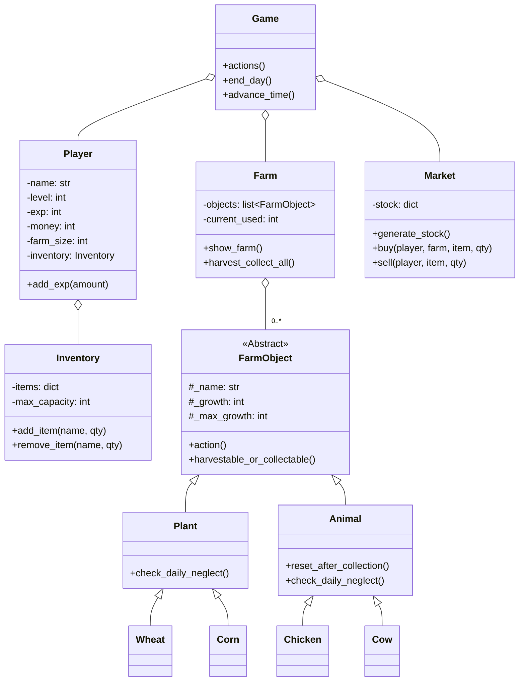

[EN](../README.md) | [ID](README_ID.md) | CN
# 🌾 Python 农场模拟游戏


欢迎来到 **Python 农场模拟游戏**，这是一款使用 Python 构建的命令行农场模拟游戏。管理您的农场，种植作物，饲养动物，并在市场上出售您的产品。您的目标是通过管理资金和支付日益增加的每日税款来尽可能地生存下去。该项目全面展示了面向对象编程，具有继承、抽象类和模块化设计等特点。

---

## 🎮 游戏玩法演示

整个游戏在您的终端中运行，提供清晰且互动的农场体验。

**在一个屏幕上管理您的农场、物品栏并查看时间：**
```
================================================================================
🧑‍🌾 FARMER: KELVIN | ⭐ LV: 1 | 💰 MONEY: $75 | 🗓️ DAY: 1 | ⏰ TIME: 08:00 | 📈 EXP: 0/20
================================================================================

==================================================
🚜 FARM STATUS
--------------------------------------------------
[1 ] 🌱 Wheat       (1 slot) [3/3 ] -> READY! (Action: ✅)
[2 ] 🌱 Wheat       (1 slot) [2/3 ] -> Growing... (Action: ✅)
[3 ] 🌱 Wheat       (1 slot) [1/3 ] -> LOW GROWTH! (Action: ❌)
[4 ] 🐄 Cow         (3 slot) [5/5 ] -> READY! (Action: ✅)
--------------------------------------------------
SLOTS USED: 6/15 | REMAINING SLOTS: 9

==================================================
🎒 INVENTORY
--------------------------------------------------
  Milk           : 2 QTY
--------------------------------------------------
SLOTS USED: 2/15

==================================================
📜 MAIN MENU:
==================================================
 1    Water plants (💧 +1 hour per plant)
 2    Feed animals (🥕 +1 hour per animal)
 3    Harvest & Collect (🌾🥚 END DAY/Collect All)
 4    Market Menu (🛒 Buy/Sell)
 5    View Game Rules (📚)
 6    Quit game (🚪)
==================================================
Choose action (1-6):
```

---

## ✨ 核心功能

-   **农场模拟**: 种植作物，饲养动物，并管理您有限的农场空间。
-   **动态日夜循环**: 时间会随着您的操作而推进。一天在 22:00 结束，自动触发每日税款、市场补货和疏忽检查。
-   **经济挑战**: 从有限的资金开始，从动态市场购买种子和动物，出售您的产品，并支付日益增加的每日税款。如果破产，游戏就结束了！
-   **等级与进程**: 通过收获和收集获得经验值以升级。每个级别都会增加您的农场大小和物品栏容量。
-   **动态市场**: 市场的种子和动物库存每天都会随机变化，需要您调整策略。
-   **疏忽系统**: 必须每天照顾植物和动物。如果被忽视，它们的生长会减慢，最终可能死亡并从您的农场消失。
-   **资源管理**: 仔细平衡您的时间、金钱、农场空间和物品栏容量，以尽可能多地生存下去。

---

## 🛠️ 技术展示

该项目是关键编程原则的实践展示：

-   **面向对象编程 (OOP)**: 整个项目围绕清晰的类层次结构构建，包括 `Game`、`Player`、`Farm`、`Market` 和 `FarmObject`。
-   **抽象基类 (ABC)**: `FarmObject` 类是一个抽象类，为所有农场实体定义了一个通用接口，确保 `Plant` 和 `Animal` 都具有一致的方法。
-   **继承 (Inheritance)**: `Plant` 和 `Animal` 继承自 `FarmObject`。像 `Wheat`、`Corn`、`Chicken` 和 `Cow` 这样的具体类型则继承自 `Plant` 或 `Animal`，展示了多层次的继承结构。
-   **模块化设计**: 代码被分离到逻辑模块中（`Entities`、`Game.py` 等），使项目组织有序且易于维护。

---

## 🏛️ 架构与类图

游戏的架构由 `Game` 类管理，它持有 `Player`、`Farm` 和 `Market` 的实例。`Farm` 包含一个 `FarmObject` 列表，这些对象是 `Plant` 和 `Animal` 子类的具体实例。



---

## 🚀 开始使用

运行此游戏不需要外部库。

### 先决条件
- Python 3.x

### 运行游戏
1.  确保所有项目文件都在相同的目录结构中。
2.  打开一个终端或命令提示符。
3.  导航到项目的根目录。
4.  运行主游戏文件：
    ```sh
    python Game.py
    ```
5.  输入您的名字并按照屏幕上的菜单进行游戏！

## 👤 贡献者

<table border="0" cellspacing="10" cellpadding="5">
  <tr>
    <td align="center" style="border: 1px solid #555; padding: 10px;">
      <a href="https://github.com/Rolexx17">
        
      </a>
      <br/>
      <a href="https://github.com/Rolexx17">Rolexx17</a>
    </td>
    <td align="center" style="border: 1px solid #555; padding: 10px;">
      <a href="https://github.com/cherriebuns">
        
      </a>
      <br/>
      <a href="https://github.com/cherriebuns">cherriebuns</a>
    </td>
    <td align="center" style="border: 1px solid #555; padding: 10px;">
      <a href="https://github.com/Rolexx17">
        
      </a>
      <br/>
      <a href="https://github.com/Rolexx17">Rolexx17</a>
    </td>
    
  </tr>
</table>