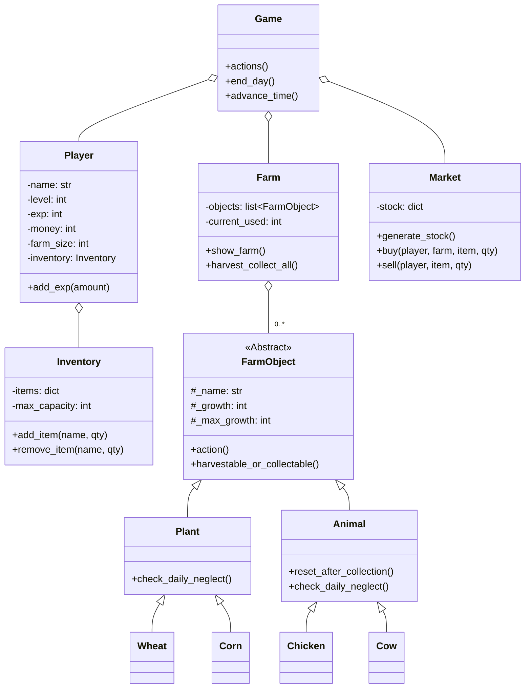

[EN](README.md) | ID | [CN](README_CN.md)
# 🌾 Simulasi Bertani dengan Python


Selamat datang di **Simulasi Bertani Python**, sebuah game simulasi pertanian berbasis baris perintah (command-line) yang dibangun dengan Python. Kelola pertanian Anda, tanam tanaman, beternak hewan, dan jual produk Anda di pasar. Tujuan Anda adalah bertahan selama mungkin dengan mengelola uang Anda dan membayar pajak harian yang terus meningkat. Proyek ini adalah demonstrasi komprehensif Pemrograman Berbasis Objek, yang menampilkan pewarisan, kelas abstrak, dan desain modular.

---

## 🎮 Demo Gameplay

Seluruh permainan berjalan di terminal Anda, memberikan pengalaman bertani yang jelas dan interaktif.

**Kelola pertanian, inventaris, dan periksa waktu Anda dalam satu layar:**
```
================================================================================
🧑‍🌾 FARMER: KELVIN | ⭐ LV: 1 | 💰 MONEY: $75 | 🗓️ DAY: 1 | ⏰ TIME: 08:00 | 📈 EXP: 0/20
================================================================================

==================================================
🚜 FARM STATUS
--------------------------------------------------
[1 ] 🌱 Wheat       (1 slot) [3/3 ] -> READY! (Action: ✅)
[2 ] 🌱 Wheat       (1 slot) [2/3 ] -> Growing... (Action: ✅)
[3 ] 🌱 Wheat       (1 slot) [1/3 ] -> LOW GROWTH! (Action: ❌)
[4 ] 🐄 Cow         (3 slot) [5/5 ] -> READY! (Action: ✅)
--------------------------------------------------
SLOTS USED: 6/15 | REMAINING SLOTS: 9

==================================================
🎒 INVENTORY
--------------------------------------------------
  Milk           : 2 QTY
--------------------------------------------------
SLOTS USED: 2/15

==================================================
📜 MAIN MENU:
==================================================
 1    Water plants (💧 +1 hour per plant)
 2    Feed animals (🥕 +1 hour per animal)
 3    Harvest & Collect (🌾🥚 END DAY/Collect All)
 4    Market Menu (🛒 Buy/Sell)
 5    View Game Rules (📚)
 6    Quit game (🚪)
==================================================
Choose action (1-6):
```

---

## ✨ Fitur Utama

-   **Simulasi Pertanian**: Tanam tanaman, beternak hewan, dan kelola ruang terbatas di pertanian Anda.
-   **Siklus Hari Dinamis**: Waktu berjalan seiring Anda melakukan tindakan. Hari berakhir pada pukul 22:00, yang secara otomatis memicu pajak harian, pengisian ulang stok pasar, dan pemeriksaan kelalaian.
-   **Tantangan Ekonomi**: Mulai dengan dana terbatas, beli bibit dan hewan dari pasar yang dinamis, jual produk Anda, dan bayar pajak harian yang meningkat seiring waktu. Jika bangkrut, permainan berakhir!
-   **Level & Progresi**: Dapatkan EXP dari panen dan pengumpulan untuk naik level. Setiap level meningkatkan ukuran pertanian dan kapasitas inventaris Anda.
-   **Pasar Dinamis**: Stok bibit dan hewan di pasar berubah secara acak setiap hari, mengharuskan Anda untuk menyesuaikan strategi.
-   **Sistem Kelalaian**: Tanaman dan hewan harus dirawat setiap hari. Jika diabaikan, pertumbuhan mereka akan berkurang, dan akhirnya mereka bisa mati dan hilang dari pertanian Anda.
-   **Manajemen Sumber Daya**: Seimbangkan waktu, uang, ruang pertanian, dan kapasitas inventaris Anda dengan hati-hati untuk bertahan selama mungkin.

---

## 🛠️ Pameran Teknis

Proyek ini adalah demonstrasi praktis dari prinsip-prinsip utama pemrograman:

-   **Pemrograman Berbasis Objek (PBO/OOP)**: Seluruh proyek dibangun di sekitar hierarki kelas yang jelas, termasuk `Game`, `Player`, `Farm`, `Market`, dan `FarmObject`.
-   **Kelas Dasar Abstrak (ABC)**: Kelas `FarmObject` adalah kelas abstrak yang mendefinisikan antarmuka umum untuk semua entitas pertanian, memastikan bahwa `Plant` dan `Animal` memiliki metode yang konsisten.
-   **Pewarisan (Inheritance)**: `Plant` dan `Animal` mewarisi dari `FarmObject`. Tipe spesifik seperti `Wheat`, `Corn`, `Chicken`, dan `Cow` kemudian mewarisi dari `Plant` atau `Animal`, menunjukkan struktur pewarisan multi-level.
-   **Desain Modular**: Kode dipisahkan ke dalam modul-modul logis (`Entities`, `Game.py`, dll.), membuat proyek terorganisir dan mudah dipelihara.

---

## 🏛️ Arsitektur & Diagram Kelas

Arsitektur game dikelola oleh kelas `Game`, yang menampung instance dari `Player`, `Farm`, dan `Market`. `Farm` berisi daftar `FarmObject`, yang merupakan instance konkret dari subkelas `Plant` dan `Animal`.



---

## 🚀 Cara Memulai

Tidak ada *library* eksternal yang diperlukan untuk menjalankan game ini.

### Prasyarat
- Python 3.x

### Menjalankan Game
1.  Pastikan semua file proyek berada dalam struktur direktori yang sama.
2.  Buka terminal atau *command prompt*.
3.  Arahkan ke direktori utama proyek.
4.  Jalankan file game utama:
    ```sh
    python Game.py
    ```
5.  Masukkan nama Anda dan ikuti menu di layar untuk bermain!

## 👤 Kontributor

<table border="0" cellspacing="10" cellpadding="5">
  <tr>
    <td align="center" style="border: 1px solid #555; padding: 10px;">
      <a href="https://github.com/Rolexx17">
        
      </a>
      <br/>
      <a href="https://github.com/Rolexx17">Rolexx17</a>
    </td>
    <td align="center" style="border: 1px solid #555; padding: 10px;">
      <a href="https://github.com/cherriebuns">
        
      </a>
      <br/>
      <a href="https://github.com/cherriebuns">cherriebuns</a>
    </td>
    <td align="center" style="border: 1px solid #555; padding: 10px;">
      <a href="https://github.com/Rolexx17">
        
      </a>
      <br/>
      <a href="https://github.com/Rolexx17">Rolexx17</a>
    </td>
    
  </tr>
</table>