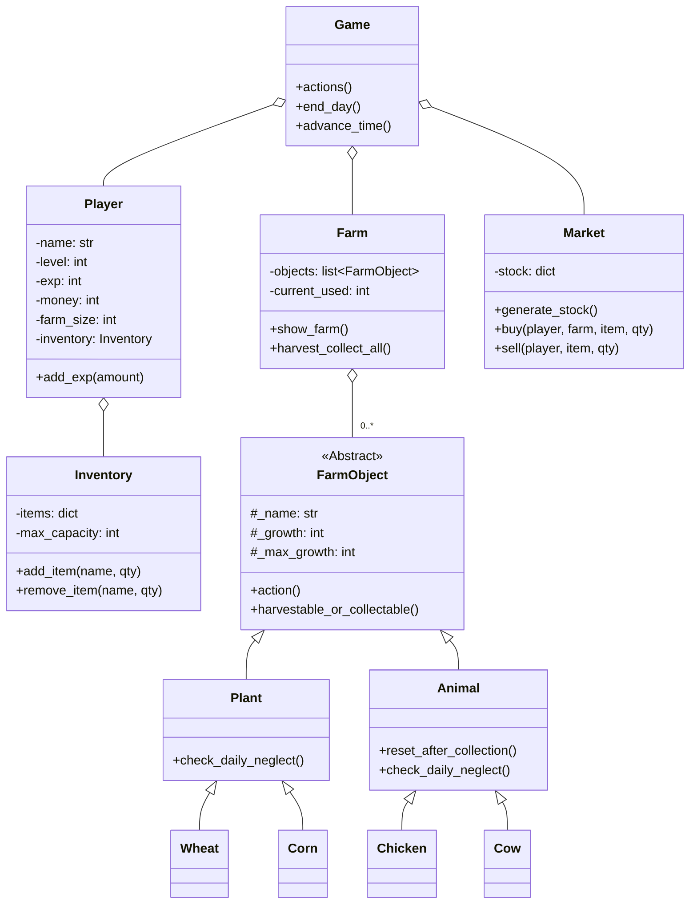

[EN](../README.md) | ID | [CN](README_CN.md)

# 🌾 Farming Game

**Farming Game** adalah simulasi bertani berbasis terminal yang dibuat dengan Python. Tanam tanaman, pelihara hewan, kelola sumber daya, dan bertahan dari pajak harian yang terus meningkat. Bisakah kamu bertahan dan sukses sebagai petani?

---

## Daftar Isi

- [Fitur](#fitur)
- [Pratinjau Permainan](#pratinjau-permainan)
- [Gambaran Umum Permainan](#gambaran-umum-permainan)
- [Instalasi](#instalasi)
- [Memulai](#memulai)
- [Struktur Kode](#struktur-kode)
- [Arsitektur & Diagram Kelas](#arsitektur--diagram-kelas)
- [Lokalisasi](#lokalisasi)
- [Kontribusi](#kontribusi)
- [Penulis](#penulis)
- [Kontak & Umpan Balik](#kontak--umpan-balik)

---

## 🌟 Fitur

- **Antarmuka Berbasis Teks:** Mainkan secara interaktif di terminal kamu.
- **Manajemen Pertanian:** Tanam dan panen tanaman, beri makan dan pelihara hewan.
- **Pasar Dinamis:** Beli benih dan hewan, jual produkmu; stok pasar di-reset tiap hari.
- **Sistem Level:** Naik level untuk memperluas kapasitas pertanian dan inventori.
- **Siklus Siang/Malam:** Setiap aksi menghabiskan waktu; hari berakhir pukul 22:00.
- **Sistem Penelantaran:** Tanaman/hewan yang tidak dirawat akan kehilangan pertumbuhan atau mati.
- **Ekonomi Bertahan:** Bayar pajak harian yang terus naik; bangkrut berarti game over.
- **Dokumentasi Multi-bahasa:** Tersedia dalam Bahasa Inggris, Indonesia, dan Mandarin.

---

## 🎮 Pratinjau Permainan

Saat kamu memulai Farming Game, kamu akan melihat tampilan status yang jelas dan interaktif:

```
================================================================================
🧑‍🌾 PETANI: ALEX  |  ⭐ LV: 3  |  💰 UANG: $125  |  🗓️ HARI: 5  |  ⏰ WAKTU: 12:00  |  📈 EXP: 34/50
================================================================================

==================================================
🚜 STATUS PERTANIAN
--------------------------------------------------
[1 ] 🌱 Gandum      (1 slot) [3/3 ] -> SIAP PANEN! (Aksi: ✅)
[2 ] 🌱 Jagung      (1 slot) [1/3 ] -> PERTUMBUHAN RENDAH! (Aksi: ❌)
[3 ] 🐄 Sapi        (3 slot) [5/5 ] -> SIAP PANEN! (Aksi: ✅)
[4 ] 🐔 Ayam        (1 slot) [2/2 ] -> SIAP PANEN! (Aksi: ✅)
--------------------------------------------------
SLOT TERPAKAI: 6/18 | SLOT TERSISA: 12

==================================================
🎒 INVENTORI
--------------------------------------------------
  Gandum         : 2 QTY
  Susu           : 1 QTY
  Telur          : 3 QTY
--------------------------------------------------
SLOT TERPAKAI: 3/20

==================================================
📜 MENU UTAMA:
==================================================
  1    Siram tanaman (💧 +1 jam per tanaman)
  2    Beri makan hewan (🥕 +1 jam per hewan)
  3    Panen & Koleksi (🌾🥚 AKHIRI HARI/Koleksi Semua)
  4    Menu Pasar (🛒 Beli/Jual)
  5    Lihat Aturan Permainan (📚)
  6    Keluar permainan (🚪)
==================================================
Pilih aksi (1-6):
```

**Aksi kamu:**
- Lihat status pertumbuhan tanaman dan hewan, termasuk yang siap dipanen atau butuh perhatian.
- Siram tanaman, beri makan hewan, panen, koleksi hasil ternak, dan kelola inventori.
- Kunjungi pasar untuk membeli benih/hewan atau menjual hasil panen.
- Bertahan tiap hari saat pajak naik, perluas pertanian dan capai level baru.
- Jika tanaman/hewan diabaikan, mereka kehilangan pertumbuhan dan bisa mati. Jika uang habis, permainan berakhir!

---

## 📝 Gambaran Umum Permainan

Farming Game adalah simulasi manajemen sumber daya. Setiap giliran mewakili satu hari di pertanianmu. Seimbangkan waktu, uang, dan ruang untuk mengoptimalkan hasil pertanian dan bertahan selama mungkin.

**Elemen Utama Permainan:**
- Tanam dan siram tanaman
- Beri makan dan koleksi hasil dari hewan
- Jual produk di pasar dengan stok yang berubah-ubah
- Bayar pajak harian
- Hindari bangkrut dan pertahankan keberhasilan pertanianmu
- Naik level untuk membuka slot pertanian dan kapasitas inventori lebih banyak

---

## 💻 Instalasi

### Prasyarat

- Python 3.x (Tidak butuh dependensi eksternal)

### Langkah Instalasi

1. Clone repositori:
   ```sh
   git clone https://github.com/Rolexx17/Farming-Game.git
   cd Farming-Game
   ```

2. (Opsional) Buat virtual environment:
   ```sh
   python -m venv venv
   source venv/bin/activate  # Windows: venv\Scripts\activate
   ```

---

## 🚀 Memulai

1. Pastikan semua file sudah di struktur direktori yang benar.
2. Jalankan file utama:
   ```sh
   python Game.py
   ```
3. Masukkan nama kamu saat diminta.
4. Ikuti instruksi menu untuk bermain.

---

## 📂 Struktur Kode

```
Farming-Game/
├── Game.py                # Loop utama & menu game
├── Entities/              # Modul utama logika game
│   ├── Farm.py            # Manajemen pertanian & slot tanaman/hewan
│   ├── Farm_Object.py     # Kelas abstrak & utama untuk entitas pertanian
│   ├── Inventory.py       # Logika inventori produk dan kapasitas
│   ├── Market.py          # Logika pasar beli/jual
│   ├── Player.py          # Statistik, level, dan progres pemain
│   └── Utils.py           # Fungsi utilitas & konstanta
├── README.md
├── .gitignore
└── docs/
    ├── README_ID.md       # Dokumentasi Bahasa Indonesia
    └── README_CN.md       # Dokumentasi Bahasa Mandarin
```

Lihat direktori [Entities](Entities/) untuk logika modular dan definisi kelas.

---

## 🏗️ Arsitektur & Diagram Kelas

Kode menggunakan prinsip OOP untuk kemudahan pengembangan dan skalabilitas.



---

## 🤝 Kontribusi

Kontribusi, saran, dan penambahan fitur sangat diterima!

- Fork repositori
- Buat branch (`git checkout -b nama-fitur`)
- Commit perubahanmu
- Buka pull request

---

## 👥 Penulis

<table border="0" cellspacing="10" cellpadding="5">
  <tr>
    <td align="center" style="border: 1px solid #555; padding: 10px;">
      <a href="https://github.com/Rolexx17">
        
      </a>
      <br/>
      <a href="https://github.com/Rolexx17">Rolexx17</a>
    </td>
    <td align="center" style="border: 1px solid #555; padding: 10px;">
      <a href="https://github.com/cherriebuns">
        
      </a>
      <br/>
      <a href="https://github.com/cherriebuns">cherriebuns</a>
    </td>
    <td align="center" style="border: 1px solid #555; padding: 10px;">
      <a href="https://github.com/isthatyou-aye">
        
      </a>
      <br/>
      <a href="https://github.com/isthatyou-aye">Kelvin Kurniawan</a>
    </td>
    
  </tr>
</table>

---

## 📬 Kontak & Umpan Balik

Buka issue atau PR untuk bug, permintaan fitur, atau umpan balik.  
Untuk kontak langsung, gunakan profil GitHub di atas.
